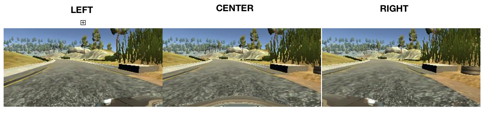
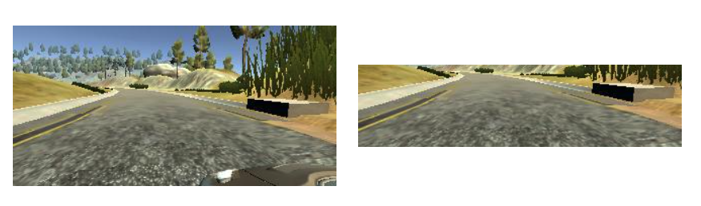
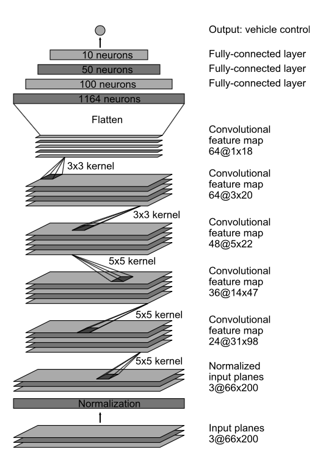

# Behavioral-Cloning
Use Keras to train a Deep Neural Network to clone human driving behavior, then drive a car around a race track autonomously.

In Behavioral Cloning, a neural network is trained to clone certain behavior. In the example of a self-driving car, the network will mimic the behaviors of the human driver -- accelerating, turning, or decelerating as a human would, when a human would.

The scenario in this repository is very similar to the scenario in the following paper, "End to End Learning for Self-Driving Cars", published by several engineers from NVIDIA. The paper can be found here, 

http://images.nvidia.com/content/tegra/automotive/images/2016/solutions/pdf/end-to-end-dl-using-px.pdf

The authors of the paper obtained excellent results when using a neural network as the sole means of decision making for driving a car in the real-world. The same concepts present in that real-life application are also present in this simulation environment, which makes this project incredibly practical and powerful.

To create the image database on which this network is trained, a race track simulator is used. The simulator will capture 3 images from the perspective of the front of the vehicle, shown below. 

 

For every set of images, the corresponding steering angle, throttle, break, and speed, are recorded. Paths to these images and the vehicle metrics are saved in a CSV file. To collect data, a human operator simply drives the car around the race track and the simulator collects the data.

There are several data-preprocessing steps taken that build the training dataset the network uses to clone behavior. First, the model converts the image from the BGR color-channel to the YUV color-channel because YUV may have significant benefits in machine learning approaches. 

Next, the network will double the size of the dataset by inverting images about the Y-axis and taking the opposite of the corresponding steering angle. This approach simulates driving the opposite direction around the racetrack, which benefits the network in generalization. 

After, the model will normalize the data in order to obtain a zero mean. Having a zero mean allows the network to perform more efficienly when optimizing - that is, performing gradient descent to update the network parameters.

Lastly, the image is cropped by the network. As seen below, the image contains a lot of unncessary information, like trees, sky, mountains, and part of the hood. If the original image is used, the network will associate the information about the trees, sky, mountains, and parts of the hood with the steering angle. Cropping is performed in order to remove this unncessary information and allow the network to focus solely on the road.

 

The architecture of the network is consistent with that in the paper above and is shown below. For more information on convolutional networks, take a look at the other Deep Learning projects located on this page. 

 

Behavioral Cloning has significant advantages over a general robotics approach. In the traditional approach, a great deal of time and testing are spent generating complex motion models that describe vehicle movement and control. With neural networks, the network figures out what is important by itself through repetitive exposure to training data. In fact, deep learning allows for a feedback loop -- where more time driving results in more data collected and more data to train on. This concept is what makes neural networks so powerful.

The following video shows the network driving the car around the track autonomously. The simulator and python program (which implemented the nerual network) communicate through a port. An image is sent to the program which it feeds to the network. The network will return a steering angle prediction, which can be seen on the left side of the video. The number on the right side of the steering angle (which is 0.2) is the speed. That is kept constant. 

 

The performance seen is the result of myself collecting data for a few laps (equal to a couple of minutes). In a real-world scenario, data collection would take many days and result in hundreds of thousands of images, as done in the paper above. 

Motion isn't perfect, but what is important to note is the power behind the concepts present in this project -- is it possible for a neural network to be used as the sole tool to drive a car autonomously. 

