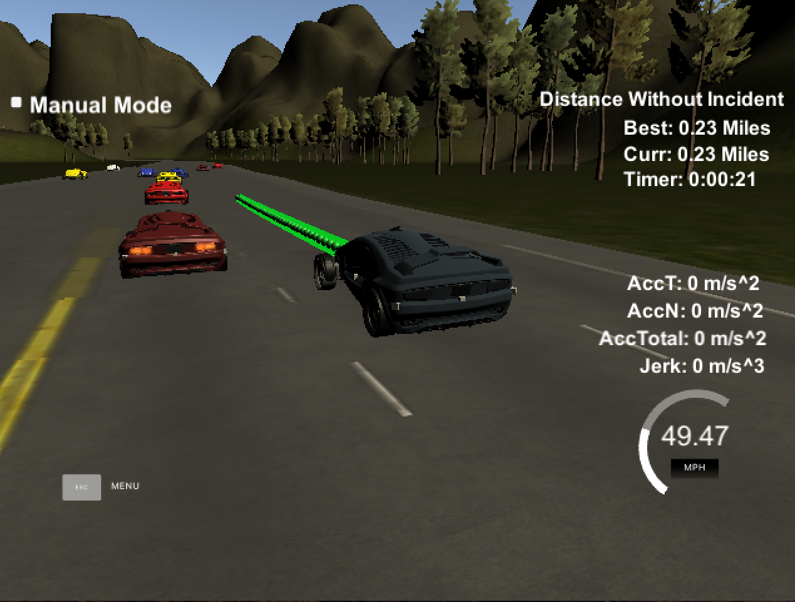

# Path-Planning
Create a model that drives a car down a highway autonomously.

The goal is to design a Path Planner that is able to create smooth, safe paths for the car to follow along a 3 lane highway with traffic.

 

This path planner placed in the top 25 in the Bosch Path Planning Challenge, which judged on fastest completion time without incident. Information on the challenge can be view here:

https://www.udacity.com/bosch-challenge

and a video of the path planner driving Bosch's test track can be viewed here:

https://youtu.be/yUMakqBSwp0

This path planning model has driven 7 miles successfully in Udacity's highway simulator -- the score rubic was 5 miles. A video of the path planner driving Udacity's track can be viewed here:

https://youtu.be/UYd1KcT7Z4s

A successful path planner will be able to keep inside its lane, avoid hitting other cars, and pass slower moving traffic all by using localization, sensor fusion, and map data.

Localization is provided by way of a map of landmarks (also known as waypoints). The car uses these landmarks to center itself on the road. Conversion between Global (X,Y) coordinates and Frenet (S,D) coordinates occurs during path planning.

Sensor Fusion data is provided to the vehicle and simulates the results that would be obtained from Radar, Lidar, and Computer Vision data. In an actual self-driving car, one of the duties of the car's sensors is to identify other vehicles and obtain information on these vehicles -- such as velocity, orientation, and distance. The simulator provides the car with these metrics.

In the video, the green line represents the car’s trajectory. To achieve movement, the simulator places the car at the next point on that trajectory every 2ms. 

In order to ensure a safe and comfortable ride for the passenger, jerk – the change in the car’s acceleration over time – and acceleration -- the change in the car’s velocity over time -- in any given direction should not exceed 10 m/s^3 and 10 m/s^2, respectively. Moreover, jerk and acceleration over a time period of 1 second should not exceed 2 m/s^3 and 1 m/s^2, respectively. 

All things considered, the more specific goal is to generate a series of points (in Global or Frenet coordinates) such that any adjacent points do not violate the above constraints. 

Movement along a single lane is a somewhat straight forward process, its lane-changing that becomes very interesting.

When the car encounters a slower moving vehicle in-front, it uses a Finite-State Machine (FSM) to decide the next action. The role of an FSM is to make a decision. By taking the current state, new information, and applying rules, the FSM provides a new state that the object of the FSM model will transitions into. In our case, the car will stay in its lane or change into the left/right lane.

When the FSM decides to change lanes, a trajectory into that lane must be generated. Suppose our car is in the middle lane and the FSM decides to change into the left lane due to another car swerving into our lane. Given the current velocity of our car, my model will identify a region on the left lane (similar to an ellipse) and sample numerous points (using a Gaussian that defines this region) at different time frames. 

What the model obtains are numerous target coordinates in the left lane that range in time, between 2-3 seconds and up to 6-7 seconds, and converts these coordinates into a target state -- where I want the car to be at a specific time.

Using the current state, target state, and timeframe, the model generates a trajectory by solving a Quintic Polynomial which is derived from the position function of the car. This Quintic Polynomial is also known as a Jerk-Minimizing Trajectory (JMT) – exactly what we need to evaluate, if we are to satisfy the above constraints.

Although a JMT is jerk-minimizing for the current/target states and timeframe, it may not be for our constraints. As such, each JMT must be evaluated against several cost functions.

A cost function will penalize a JMT proportional to how badly the trajectory deviates from the property the cost function is evaluating. These properties may correspond to total jerk, total acceleration, jerk/second, acceleration/second, distance from other vehicles, distance to center lane, and time to completion (in certain situations, we may favor a trajectory that completes faster). 

After filtering each trajectory through cost functions, the JMT with the lowest cost is implemented. This JMT will satisfy all the above constraints.

To implement this trajectory, the model generates a few points several 10s of meters outward using the JMT and fits these points to a Spline (the following is a great API for this, http://kluge.in-chemnitz.de/opensource/spline/). Then, the model uses the spline to generate points that do not exceed the speed limit, all the while satisfying the constraints. These points are then converted into global coordinates and provided to the simulator for execution.

When a violation occurs (collision, speed infraction, lane infraction, acceleration/jerk infraction), the simulator throws a large error across the screen. As can be seen in the linked videos, the car drives safely for several miles with no violations.
