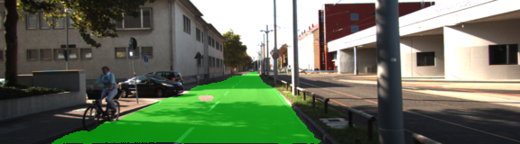

# Semantic-Segmentation
Create and train a Fully Convolutional Network (FCN) using VGG16 in TensorFlow, painting each pixel in an image based on its class.

 

FCNs represent the forefront of Scene Understanding, which answers "where" in an image is the object of interest. Scene Understanding is a vital component of autonomous vehicle functionality, greatly enhancing perception and producing higher quality decision making.

The network architecture is an implementation of the model used in the paper, "Fully Convolutional Networks For Semantic Segmentation", by Long, Shelhamer, and Darrell. The paper can be viewed here,

Fully Convolutional Models for Semantic Segmentation
Evan Shelhamer*, Jonathan Long*, Trevor Darrell
PAMI 2016
arXiv:1605.06211

https://people.eecs.berkeley.edu/~jonlong/long_shelhamer_fcn.pdf

Convolutional networks classify an image as either containing the object of interest or not. Typically, the strucutre of a convolutional network contains a series of convolution, pooling, and activation layers followed by a fully connected layer(s). Important spatial information that identifies where an object is located within an image is lost at the transition into fully connected layer(s).

To retain this spatial information, FCNs replace fully connected layers with a 1x1 convolutional layer and the output of this 1x1 convolutional layer is fed into a decoder. A decoder is a series of transposed convolutinal layers that work to upscale the data -- transforming it back to its original shape, with every pixel being classified. Decoding can be thought of as deconvolution.

In this model, the convolutional layers prior to 1x1 convolutional layer are of the VGG network. In order to decrease training time of this model, the first half of the network implements the convolutional layers of the VGG network. Theses VGG layers have been trained on the ImageNet dataset for several days and as such, contain a great deal of intelligence that extracts complex spatial features of an image -- features that the network uses to uniquely identify an object.  

The process of adapting a pre-trained model for a similar purpose than what was originally intended is called Transfer Learning. Transfer Learning is a very popular approach taken by Deep Learning Engineers to save time when developing networks. AlexNet, VGG, GoogLeNet, and ResNet, are the most popular pre-trained networks engineers adapt in order to solve their image classification problems.

Main.py contains deeper discussions of FCN architecture and actual implementation using Tensorflow. It describes in-detail the role of each function, FCN concepts, and variables, as they relate to a Fully Convolutional Network.

## 
 Network Output 

 

 

 

 

 

